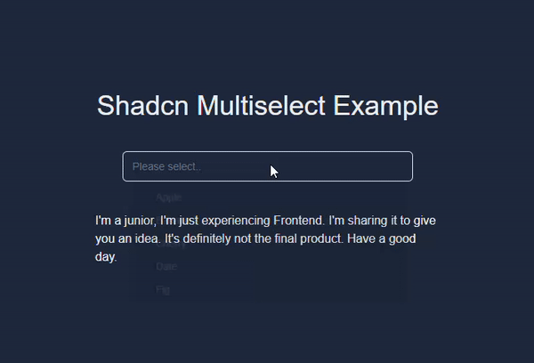

# 🧩 Multiselect Component for Shadcn/UI

A reusable, type-safe multiselect component built as an extension for **Shadcn/UI**. This project is a deep dive into component-driven development using **Next.js**, **TypeScript**, and **Tailwind CSS**.

## Example view


## 🎯 Project Purpose
The goal of this project was to create a flexible and accessible multiselect input that seamlessly integrates with the Shadcn/UI ecosystem. It focuses on mastering **TypeScript interfaces** and **state management** in complex UI components.

## ✨ Features (Core Intent)
- **Shadcn/UI Integration:** Designed to match the aesthetic and functional patterns of Shadcn/UI.
- **Type-Safe:** Heavily utilizes TypeScript for robust props and event handling.
- **Responsive Design:** Fully styled with Tailwind CSS for various screen sizes.
- **Searchable:** Filter through large lists of options efficiently.

## 🛠️ Tech Stack
- **Framework:** [Next.js 15](https://nextjs.org/)
- **Styling:** [Tailwind CSS](https://tailwindcss.com/)
- **Components:** [Shadcn/UI](https://ui.shadcn.com/) & [Radix UI](https://www.radix-ui.com/)
- **Language:** [TypeScript](https://www.typescriptlang.org/)

## 🚧 Current Status & Learning Journey
As a **Junior Developer**, I am using this project to experiment with complex UI patterns. 
- **Known Issues:** The state synchronization during rapid selection is currently being optimized.
- **Next Steps:** Improving keyboard navigation (WAI-ARIA compliance) to meet high accessibility standards.

## 🚀 Getting Started

1. **Clone & Install:**
   ```bash
   git clone https://github.com/ahmetunsal/multiselect-shadcn.git
   npm install
   ```
2. Run
   ```bash
   npm run dev
   ```

## 🤝 Let's Connect
I'm always open to feedback and collaboration to improve my code!
- Portfolio: unsalahmet.com
- Contact: contact.unsalahmet@gmail.com


